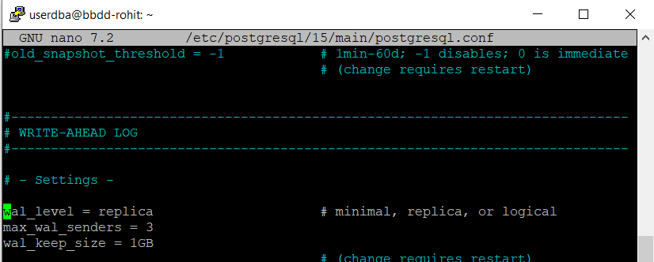
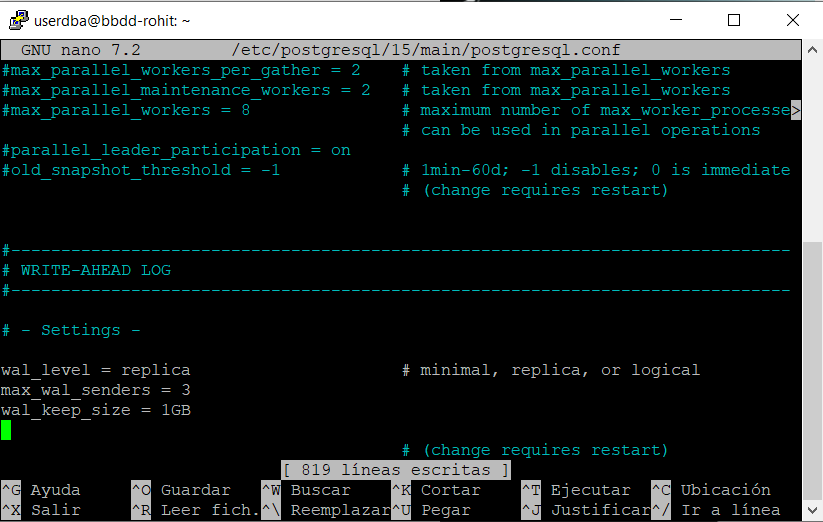
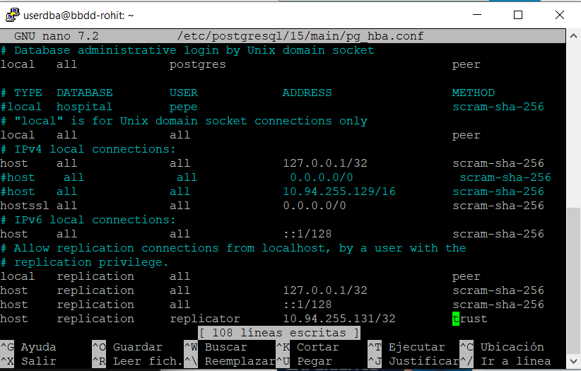
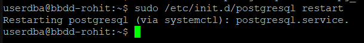
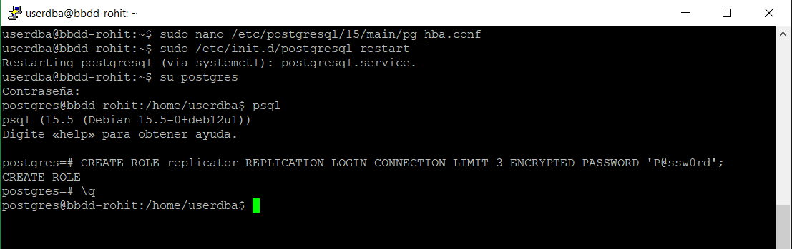
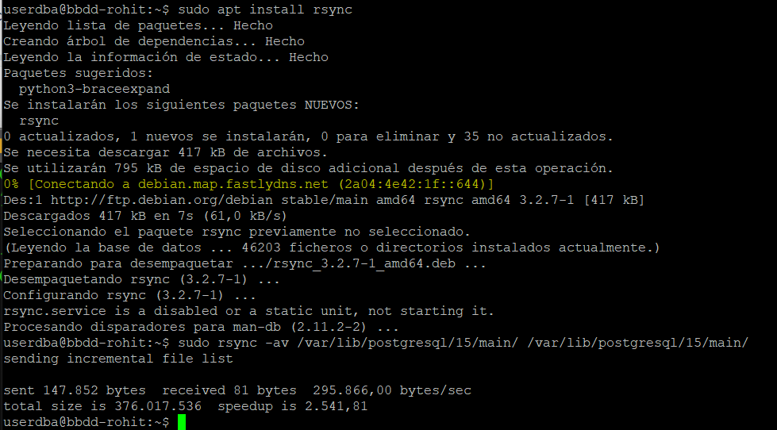
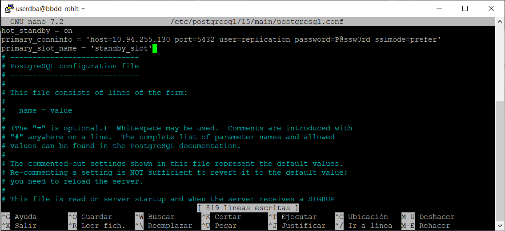
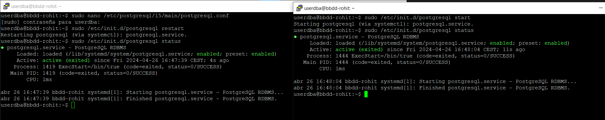

# Webgrafia
https://www.servermania.com/kb/articles/setup-postgresql-cluster

# Comandes

```
sudo apt-update
sudo nano /etc/postgresql/15/main/postgresql.conf
```


```
sudo /etc/init.d/postgresql restart
psql
CREATE USER replicator REPLICATION LOGIN CONNECTION LIMIT 3 ENCRYPTED PASSWORD 'P@ssw0rd';
\q
sudo /etc/init.d/postgresql stop
sudo apt install rsync
sudo rsync -av /var/lib/postgresql/15/main/ /var/lib/postgresql/15/main/
```

# PROCESS

`sudo nano /etc/postgresql/15/main/postgresql.conf`



`sudo nano /etc/postgresql/15/main/pg_hba.conf`









A l'altre servidor fem lo altre:






