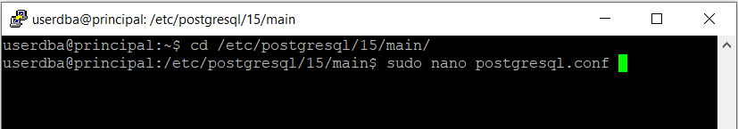
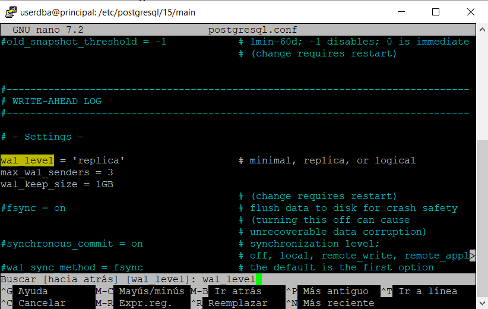
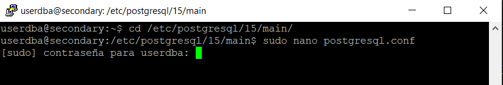
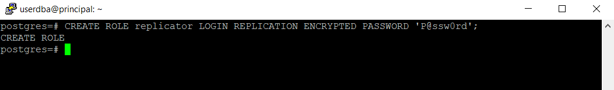
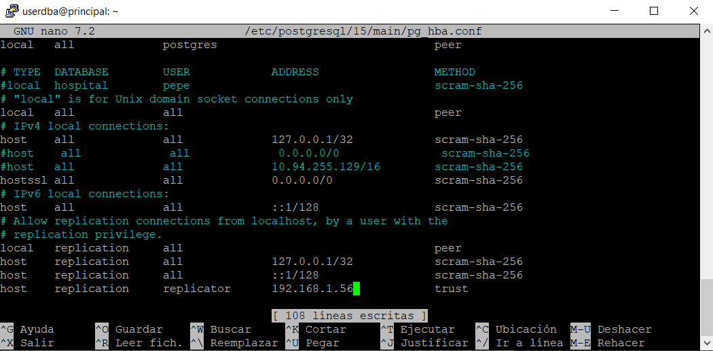
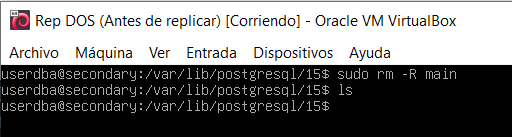
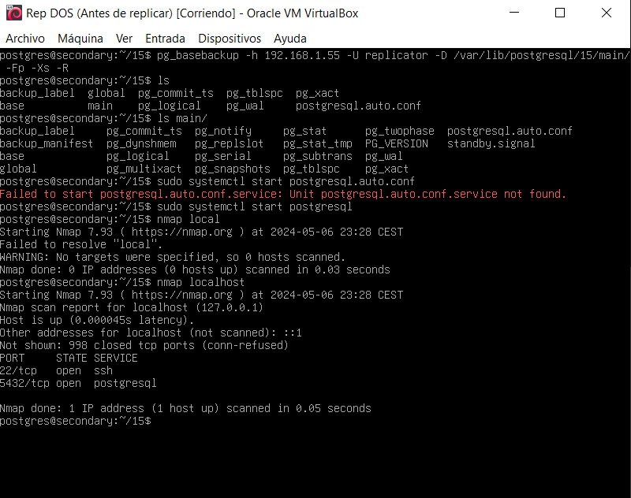
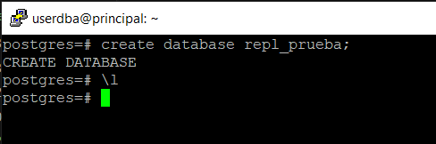
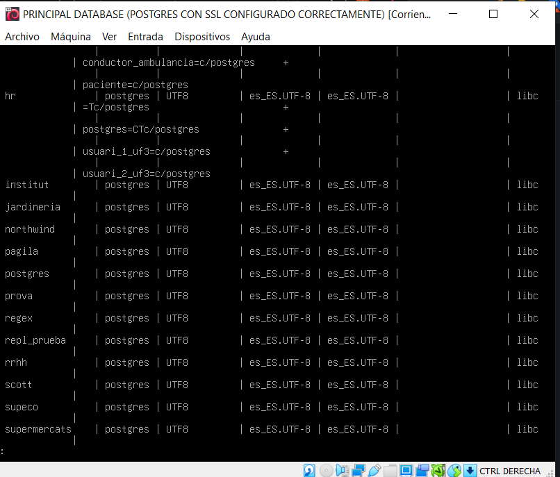

# Webgrafia
https://www.servermania.com/kb/articles/setup-postgresql-cluster

<<<<<<< HEAD
=======
# Comandes

```
sudo apt-update
sudo nano /etc/postgresql/15/main/postgresql.conf
```


```
sudo /etc/init.d/postgresql restart
psql
CREATE USER replicator REPLICATION LOGIN CONNECTION LIMIT 3 ENCRYPTED PASSWORD 'P@ssw0rd';
\q
sudo /etc/init.d/postgresql stop
sudo apt install rsync
sudo rsync -av /var/lib/postgresql/15/main/ /var/lib/postgresql/15/main/
```

# PROCESS

`sudo nano /etc/postgresql/15/main/postgresql.conf`


>>>>>>> 3338fa389aa067eaa6ffd2ba4597d9d178a744fb


# FINAL VERS

MASTER

Configurem els següents paràmetres de configuració al postgres.conf







SLAVE

Configurem els següents paràmetres de configuració al postgres.conf




MASTER

creem un rol per a fer les repliques 


Creació d'un slot per a replicacions


Ara configurem la autentificacio



Finalment reiniciem el servei postgres ambdós servidors:


Ara iniciarem la replicacio

Netejem les dades per replicar en el slave:





MASTER

select * from pg_stat_replication


SLAVE


#Prova

Creació de base de dades exemple:



