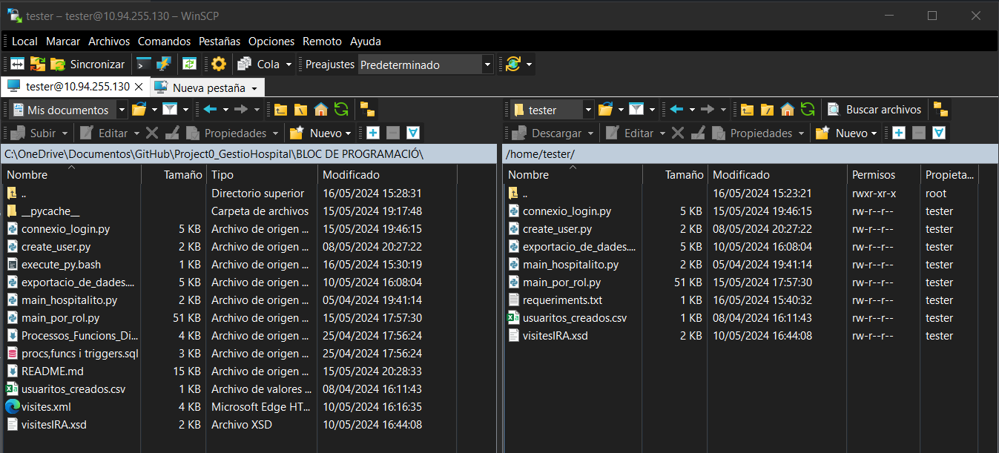
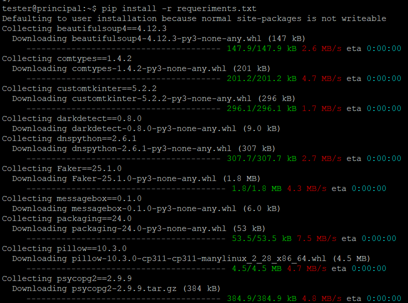
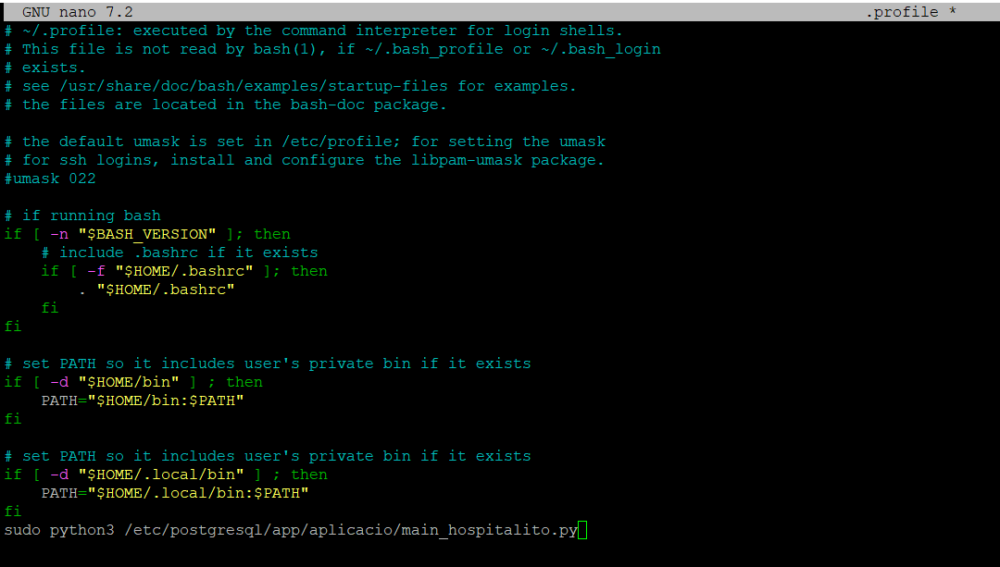
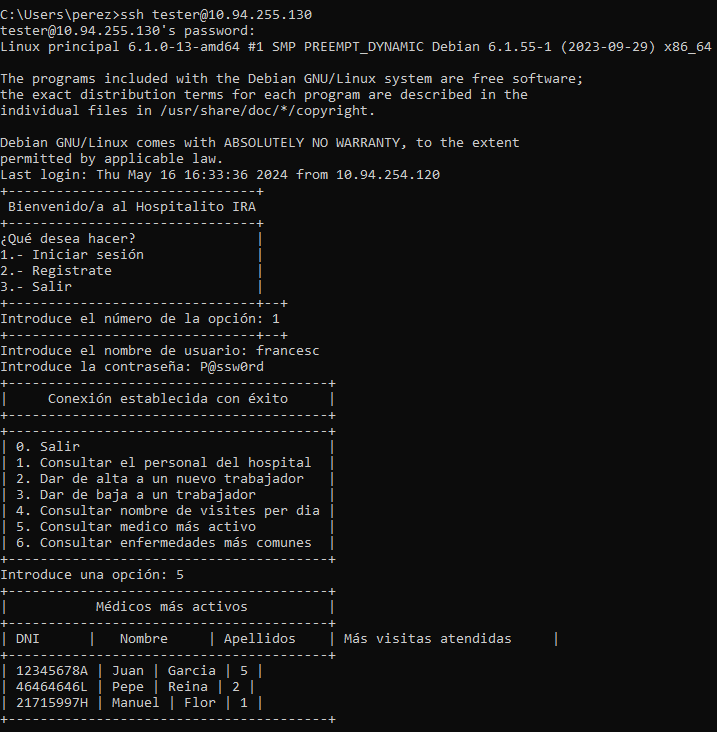
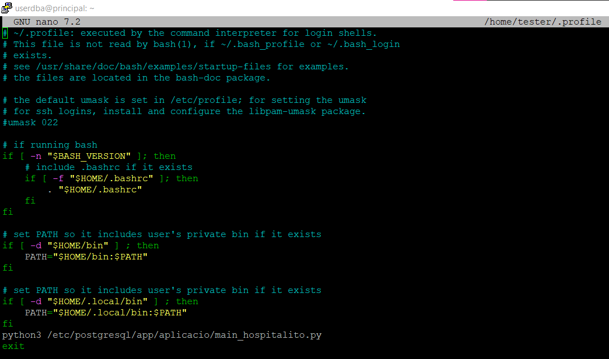
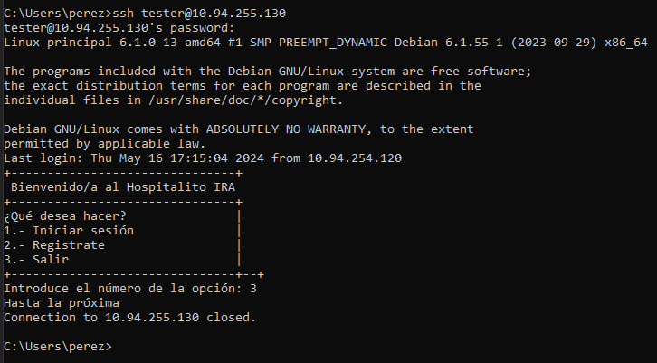

# Bloc de Programació

## Índex de continguts

1. [Codi de Programació (engloba tots els apartats de PRG)](#Codi-de-Programació)

   1.1 [Codi de connectivitat i login](#Codi-de-connectivitat-i-login)

   1.2 [Codi per registrar un nou usuari](#Codi-per-registrar-un-nou-usuari)

   1.3 [Codi del Bloc de Manteniment](#Codi-del-Bloc-de-Manteniment)

   1.3 [Codi de exportació de dades](#Codi-de-exportació-de-dades)
   
3. Processos, Funcions i Triggers.
   
5. [Exportació de dades](#Codi-de-exportació-de-dades)

## Codi de Programació
### Codi de connectivitat i login

En aquest codi fa de definició del inici de sessió amb l'usuari a la base de dades. Ja que com tenim 5 codis de Python, aquest fa com definició de login.
Depenent del rol que tinguis com usuari et sortirà un main diferent.
```
import psycopg2
import main_por_rol

def loginito(usuarito, contrasenyita):
    
    try:
        connexio = psycopg2.connect(
            dbname="hospital",
            user=usuarito,
            password=contrasenyita,
            host="10.94.255.129",
            port="5432",
            sslmode="require"
        )
        if connexio:
            return True
    except psycopg2.Error as e:
        print(f"Error en la conexión: {e}")
        return False
    finally:
        connexio.close()
```

Després d'aquest codi formem els mains que corresponen a cada rol. Però abans de això comprovem quin rol té d'aquesta forma.
Amb aquesta definició i execució d'SQL podem veure el rol de l'usuari amb el qual hem fet login.
```
def enQueRolsitoEsta(usuarito):
    
    connexio = psycopg2.connect(
        dbname="hospital",
        user="postgres",
        password="P@ssw0rd",
        host="10.94.255.129",
        port="5432",
        sslmode="require"
        )
    
    cur = connexio.cursor()
    SQLita = f"SELECT r.rolname AS usuario, r1.rolname AS rol FROM pg_catalog.pg_roles r JOIN pg_catalog.pg_auth_members m ON (m.member = r.oid) JOIN pg_roles r1 ON (m.roleid = r1.oid) WHERE r.rolcanlogin AND r.rolname = '{usuarito}' ORDER BY 1;"
    cur.execute(SQLita)
    resultadito = cur.fetchall()
    cur.close()
    connexio.close()
    rol = str(resultadito[0][1])
    return rol
```

Ara finalment fem un print de cada main.
```
def menuPorRol(rol):
    print("+----------------------------------------+")
    print("| 0. Salir                               |")
    
    if rol == "administrador_informatico":
        print("| 1. Dar de baja un usuario existente    |")
        print("| 2. Consultar usuarios existentes       |")
    
    if rol == "medico":
        print("| 1. Consultar historial de un paciente  |")
        print("| 2. Consultar medicación de un paciente |")
        print("| 3. Consultar habitación de un paciente |")
        print("| 4. Operacions previstes                |")
        print("| 5. Consultar visitas planificadas      |")
        print("| 6. Aparatos medicos por quirofano      |")
        print("| 7. Consultar enfermedades más comunes  |")
   
    if rol == "enfermero":
        print("| 1. A que medic@ estas enlazad@         |")
        print("| 2. En que habitación está el paciente  |")
        print("| 3. Que medicación tiene el paciente    |")
        print("| 4. Operacions previstes                |")
        print("| 5. Aparatos medicos por quirofano      |")
    
    if rol == "celador":
        print("| 1. En que habitación está el paciente  |")
    
    if rol == "conductor_ambulancia":
        print("| 1. Consulta la habitación de salida    |")
    
    if rol == "administrador_hospital":
        print("| 1. Consultar el personal del hospital  |")
        print("| 2. Dar de alta a un nuevo trabajador   |")
        print("| 3. Dar de baja a un trabajador         |")
        print("| 4. Consultar nombre de visites per dia |")
        print("| 5. Consultar medico más activo         |")
        print("| 6. Consultar enfermedades más comunes  |")
    
    if rol == "recepcionista":
        print("| 1. Dar de alta a un nuevo paciente     |")
        print("| 2. Consultar pacientes ingresados      |")
        print("| 3. Consultar habitaciones libres       |")
        print("| 4. Consultar habitaciones ocupadas     |")
        print("| 5. Consultar reservas de habitaciones  |")
        print("| 6. Consultar contenido de la planta    |")
    
    print("+----------------------------------------+")
    
    opcion = input("Introduce una opción: ")
    
    return opcion
```

### Codi per registrar un nou usuari

Amb la definició següent demanem el usuari i contrasenya. 
```
def registrar_usuarito():
    nombrecito_usuarito = input("Introduce el nombre del usuario: ")
    contrasenya_usuarito = input("Introduce la contraseña: ")
    encriptar_datitos(nombrecito_usuarito, contrasenya_usuarito)
    insertar_usuarito_a_la_bd(nombrecito_usuarito, contrasenya_usuarito)
```

Ara amb aquesta definició encriptarem les dades per inserir-les en un CSV.
```
def encriptar_datitos(nombrecito_usuarito, contrasenya_usuarito):
    usuarito_encriptado = hashlib.sha256(nombrecito_usuarito.encode())
    contrasenya_encriptada = hashlib.sha256(contrasenya_usuarito.encode())
    insertar_usuarito_en_csv(usuarito_encriptado, contrasenya_encriptada)
```

Ara inserim les dades que hem encriptat anteriorment al CSV.
```
def insertar_usuarito_en_csv(usuarito_encriptado, contrasenya_encriptada):
    with open("usuaritos_creados.csv", "a", newline="") as csvfile:
        csvwriter = csv.writer(csvfile)
        csvwriter.writerow([usuarito_encriptado, contrasenya_encriptada])
```

Finalment afegim l'usuari a la base de dades.
```
def insertar_usuarito_a_la_bd(nombrecito_usuarito, contrasenya_usuarito):
    
    connexio = psycopg2.connect(
        dbname="hospital",
        user="postgres",
        password="P@ssw0rd",
        host="10.94.255.129"
    )
    cur = connexio.cursor()
    
    cur.execute(f"CREATE ROLE {nombrecito_usuarito} LOGIN PASSWORD '{contrasenya_usuarito}';")
    connexio.commit()
```

### Codi del Bloc de Manteniment

Ara que hem aconseguit la connectivitat amb la base de dades hem de fer "utilitzables" els mains creats en l'apartat de [Codi de Connectivitat i login](#Codi-de-connectivitat-i-login).

Així que farem una definició per cada rol on cadascun tingui funcions diferents.
Posaré un exemple d'alguns rols, ja que es pot veure el codi complet en el enllaç seguent: [Bloc de manteniment](main_por_rol.py)

#### Rol d'administració d'hospital

Amb el codi següent podem veure el personal dividit pel seu ofici, si aquest és de "Varios", sortirà també el seu tipus de treball.
```
try:
                diccionarioEnfermeros = {}
                diccionarioMedicos = {}
                diccionarioVarios = {} 
                connexio = psycopg2.connect(
                    dbname="hospital",
                    user="postgres",
                    password="P@ssw0rd",
                    host="10.94.255.129",
                    port="5432",
                    sslmode="require"
                )
                cur = connexio.cursor()
                SQLita = f"SELECT p_id FROM personal;"
                cur.execute(SQLita)
                lista_id = cur.fetchall()
                for p_id in lista_id:
                    id_real = p_id[0]  
                    try:
                        cur.execute(f"SELECT p_id FROM medicos WHERE p_id = {id_real};")
                        resultadito2 = cur.fetchall()
                        if resultadito2:
                            cur.execute(f"SELECT dni, nombre, apellidos FROM personal WHERE p_id = {id_real};")
                            resultadito3 = cur.fetchall()
                            diccionarioMedicos[id_real] = resultadito3[0]
                    except psycopg2.Error as e:
                        pass
                    try:
                        cur.execute(f"SELECT p_id FROM enfermeros WHERE p_id = {id_real};")
                        resultadito2 = cur.fetchall()
                        if resultadito2:
                            cur.execute(f"SELECT dni, nombre, apellidos FROM personal WHERE p_id = {id_real};")
                            resultadito3 = cur.fetchall()
                            diccionarioEnfermeros[id_real] = resultadito3[0]
                    except psycopg2.Error as e:
                        pass
                    try:
                        cur.execute(f"SELECT p_id FROM varios WHERE p_id = {id_real};")
                        resultadito2 = cur.fetchall()
                        if resultadito2:
                            cur.execute(f"SELECT p.dni, p.nombre, p.apellidos, v.tipo_de_trabajo FROM personal p JOIN varios v ON p.p_id = v.p_id WHERE v.p_id = {id_real};")
                            resultadito3 = cur.fetchall()
                            diccionarioVarios[id_real] = resultadito3[0]
                    except psycopg2.Error as e:
                        pass
                    id_real = None
                cur.close()
                connexio.close()
                print("+----------------------------------------+")
                print("|           Lista de personal            |")
                print("+----------------------------------------+")
                print("| Enfermeros |")
                print("+----------------------------------------+")
                for i in diccionarioEnfermeros:
                    print(f"| DNI: {diccionarioEnfermeros[i][0]} | Nombre: {diccionarioEnfermeros[i][1]} | Apellidos: {diccionarioEnfermeros[i][2]} |")
                print("+----------------------------------------+")
                print("| Médicos |")
                print("+----------------------------------------+")
                for i in diccionarioMedicos:
                    print(f"| DNI: {diccionarioMedicos[i][0]} | Nombre: {diccionarioMedicos[i][1]} | Apellidos: {diccionarioMedicos[i][2]} |")
                print("+----------------------------------------+")
                print("| Varios |")
                print("+----------------------------------------+")
                for i in diccionarioVarios:
                    print(f"| DNI: {diccionarioVarios[i][0]} | Nombre: {diccionarioVarios[i][1]} | Apellidos: {diccionarioVarios[i][2]} | Tipo de trabajo: {diccionarioVarios[i][3]} |")
                print("+----------------------------------------+")
       
            except psycopg2.Error as e:
                
                print("No se ha podido mostrar la lista de personal.")
```

#### Rol de recepcionista

Amb el codi següent ens permet inserir un nou pacient, i que aquest automàticament tingui un usuari, aquest consta de la seva targeta sanitària però sense espais. Per defecte la contrasenya és P@ssw0rd (es pot fer una variable per posar la contrasenya que vulgui el pacient però amb aquest codi no ens oblidem de la contrasenya, ja que tots tenen la mateixa.
```
if opcion == 1:
            
                id_tarjeta_sanitaria = input("Introduce el número de tarjeta sanitaria del paciente: ")
                connexio = psycopg2.connect(
                    dbname="hospital",
                    user="postgres",
                    password="P@ssw0rd",
                    host="10.94.255.129",
                    port="5432",
                    sslmode="require"
                )
                SQLita = f"SELECT public.validar_tse('{id_tarjeta_sanitaria}');"
                cur = connexio.cursor()
                cur.execute(SQLita)
                resultadito = cur.fetchall()
                cur.close()
                connexio.close() 
                validar = True
                while validar:
                    if resultadito[0][0] == True:
                        nombre = input("Introduce el nombre del paciente: ")
                        apellidos = input("Introduce los apellidos del paciente: ")
                        fecha_nacimiento = input("Introduce la fecha de nacimiento del paciente (YYYY-MM-DD HH:MM:SS): ")
                        direccion = input("Introduce la dirección del paciente: ")
                        telefono = input("Introduce el teléfono del paciente: ")
                        contacto_emergencia = input("Introduce el contacto de emergencia del paciente: ")
                        condiciones_medicas = input("Introduce las condiciones médicas del paciente: ")
                        try:
                            connexio = psycopg2.connect(
                                dbname="hospital",
                                user="postgres",
                                password="P@ssw0rd",
                                host="10.94.255.129",
                                port="5432",
                                sslmode="require"
                            )
                            SQLita = f"INSERT INTO pacientes (id_tarjeta_sanitaria, nombre, apellidos, fecha_nacimiento, direccion, num_telefono, contacto_emergencia, condiciones_paciente) VALUES ('{id_tarjeta_sanitaria}', '{nombre}', '{apellidos}', '{fecha_nacimiento}.000000', '{direccion}', '{telefono}', '{contacto_emergencia}', '{condiciones_medicas}');"
                            cur = connexio.cursor()
                            cur.execute(SQLita)
                            connexio.commit()
                            usuario = id_tarjeta_sanitaria[0:4] + id_tarjeta_sanitaria[5] + id_tarjeta_sanitaria[7:13] + id_tarjeta_sanitaria[14:16] + id_tarjeta_sanitaria[17]
                            SQLita2 = f"CREATE ROLE {usuario} LOGIN PASSWORD 'P@ssw0rd' IN ROLE paciente;"
                            cur.execute(SQLita2)
                            connexio.commit()
                            cur.close()
                            connexio.close()
                            print("El paciente ha sido dado de alta con éxito.")
                            print(f"Tu usuario es: {usuario}")
                            print("Tu contraseña es: P@ssw0rd")
                            
                            validar = False
                        
                        except psycopg2.Error as e: 
                            
                            print("El usuario no ha podido ser creado.")
                            validar = False
                            
                    if resultadito[0][0] == False:
                        print("El número de tarjeta sanitaria no es válido.")
                        validar = False
```
### Codi de exportació de dades

Ara per poder exportar les dades de les visites utilitzarem aquest codi: [Bloc d'exportació de dades](exportacio_de_dades.py):

Ara en aquesta definició l'utilitzarem per recollir l'interval de temps on volem recollir l'informació.
```
def fechitas():
    fecha_inicio = input("Introduce la fecha de inicio de la exportación (formato: YYYY-MM-DD HH:MM:SS): ")
    fecha_fin = input("Introduce la fecha final de la exportación (formato: YYYY-MM-DD HH:MM:SS): ")
    exportacion_xml(fecha_inicio, fecha_fin)
```
La definició que es veu "fechitas", demana unes dates per recogir les visites

Despres s'executarà la definició següent:
```
def exportacion_datitos(fecha_inicio, fecha_fin):
    connexio = psycopg2.connect(
        dbname="hospital",
        user="postgres",
        password="P@ssw0rd",
        host="10.94.255.129",
        port="5432",
        sslmode="require"
    )
    cur = connexio.cursor()
    SQLita = f"SELECT p.nombre, p.apellidos, pa.id_tarjeta_sanitaria, pa.nombre, pa.apellidos, d.fecha_entrada, d.fecha_salida, d.tiene_receta, d.medicamentos, m.nombre_malaltia, p.dni FROM diagnosticos d JOIN personal p ON p.p_id = d.p_id JOIN pacientes pa ON pa.id_tarjeta_sanitaria = d.id_tarjeta_sanitaria FULL JOIN malalties m ON m.id_m = d.id_m WHERE fecha_entrada BETWEEN '{fecha_inicio}.000000' AND '{fecha_fin}.999999' ORDER BY fecha_entrada ASC;"
    cur.execute(SQLita)
    resultadito = cur.fetchall()
    cur.close()
    connexio.close()
    return resultadito
```
Aquesta definició serveix per recollir l'informació de les visites accedin a la base de dades.

Finalment amb la definició següent posem totes les dades del resultat de la definició anterior en un XML.
```
def exportacion_xml(fecha_inicio, fecha_fin):
    contador = 0
    datitos = exportacion_datitos(fecha_inicio, fecha_fin)
    xmlns = "xmlns"
    
    root = ET.Element("visitas", attrib={"xmlns:xsi": "http://www.w3.org/2001/XMLSchema-instance", "xsi:noNamespaceSchemaLocation": "visitesIRA.xsd"})
    
    
    for datito in datitos:
        ET.indent(root, space="\t", level=0)
        
        
        diagnostico = ET.SubElement(root, "visita")
        ET.indent(diagnostico, space="\t", level=1)
        
        numero_diagnostico = ET.SubElement(diagnostico, "numero_diagnostico")
        numero_diagnostico.text = str(contador)
        ET.indent(diagnostico, space="\t", level=1)
        
        dni_medico = ET.SubElement(diagnostico, "dni_medico")
        dni_medico.text = str(datito[10])
        ET.indent(diagnostico, space="\t", level=1)
        
        nombre_medico = ET.SubElement(diagnostico, "nombre_medico")
        nombre_medico.text = str(datito[0])
        ET.indent(diagnostico, space="\t", level=1)
        
        apellidos_medico = ET.SubElement(diagnostico, "apellidos_medico")
        apellidos_medico.text = str(datito[1])
        ET.indent(diagnostico, space="\t", level=1)
        
        tarjeta_sanitaria_paciente = ET.SubElement(diagnostico, "tarjeta_sanitaria_paciente")
        tarjeta_sanitaria_paciente.text = str(datito[2])
        ET.indent(diagnostico, space="\t", level=1)
        
        nombre_paciente = ET.SubElement(diagnostico, "nombre_paciente")
        nombre_paciente.text = str(datito[3])
        ET.indent(diagnostico, space="\t", level=1)
        
        apellidos_paciente = ET.SubElement(diagnostico, "apellidos_paciente")
        apellidos_paciente.text = str(datito[4])
        ET.indent(diagnostico, space="\t", level=1)
        
        fecha_entrada = ET.SubElement(diagnostico, "fecha_entrada")
        fecha_entrada_fecha = str(datito[5])[0:10]
        fecha_entrada_hora = str(datito[5])[11:19]
        fecha_entrada.text = str(fecha_entrada_fecha + "T" + fecha_entrada_hora)
        ET.indent(diagnostico, space="\t", level=1)
        
        fecha_salida = ET.SubElement(diagnostico, "fecha_salida")
        if datito[6] == None:
            fecha_salida.text = "None"
        else:
            fecha_fin_fecha = str(datito[6])[0:10]
            fecha_fin_hora = str(datito[6])[11:19]
            fecha_salida.text = str(fecha_fin_fecha + "T" + fecha_fin_hora)
        ET.indent(diagnostico, space="\t", level=1)
        
        tiene_receta = ET.SubElement(diagnostico, "tiene_receta")
        tiene_receta.text = str(datito[7])
        ET.indent(diagnostico, space="\t", level=1)
        
        medicamentos = ET.SubElement(diagnostico, "medicamentos")
        medicamentos.text = str(datito[8])
        ET.indent(diagnostico, space="\t", level=1)
        
        nombre_enfermedad = ET.SubElement(diagnostico, "nombre_enfermedad")
        nombre_enfermedad.text = str(datito[9])
        ET.indent(diagnostico, space="\t", level=1)
        
        contador += 1
        ET.indent(root, space="\t", level=0)
    tree = ET.ElementTree(root)
    
    tree.write(f"visites.xml", encoding="utf-8", xml_declaration=True)
```

### Configuració de la aplicació al inici de les connexions.

Abans de començar, ens assegurarem de tenir el nostre servidor actualitzat, executarem les següents comandes:
``` 
apt update && apt upgrade 
```

Seguidament haurem de instalar python en el servidor i instal·lar les llibreries necessàries.
Executarem la següent comanda:
```
pip freeze > requirements.txt
```

Això ens crearà un fitxer txt amb totes les llibreries que podrem importar al nostre servidor Linux.
A continuació, amb WinSCP transferirem el fitxer txt al servidor i el python de la nostra aplicació.


Seguidament executem la comanda 
```
pip install -r requriments.txt
```


A continuació, haurem d'afegir una línia al .profile de l'usuari indicant la ruta del fitxer python amb la nostra aplicació.


Accedirem amb un client per SSH per comprovar que s'executa l'script automàticament


Finalment, volem que una vegada finalitzi l'aplicació, que es talli la connexio SSH.
Per fer això, afegirem una línia amb la comanda `exit` al final del .profile


Aqui tenim la comprovació de que una vegada tancada la aplicació, finalitza la sessió.



