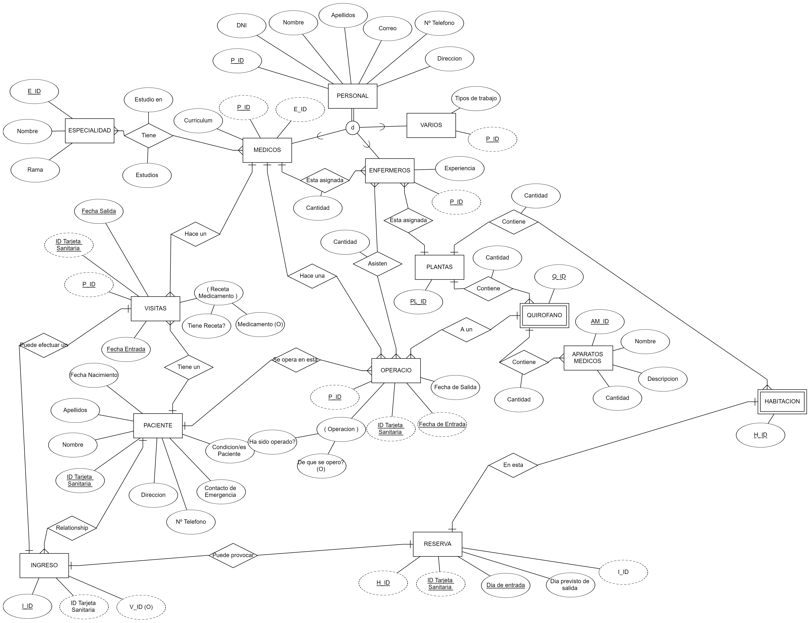

# Distribució de la base de dades
1. [Les taules de la base de dades](#Les-taules-de-la-base-de-dades)
2. [Explicació relacions](#Explicació-relacions)
3. [Codi SQL](#no-hay)

## Les taules de la base de dades

**Personal**:

Aquesta taula conte la informació global de cada treballador de l’hospital. Aquesta informació, per exemple, podria ser el DNI, nom, cognoms..., Informació que tota persona té en comú.

**Metges**:

Amb l'ID del personal podem escollir inserir-lo en aquesta taula, que fa com a referència al fet que aquest treballador és metge. També pots dir la seva especialitat (aquesta és una altra taula) i inserir el seu currículum.

**Infermers**:

Com a metges, aquesta taula serveix per identificar l'ofici del treballador, amb la diferència de metges, en aquesta taula, té una columna “Experiència”. On es pot inserir tota informació sobre les seves habilitats.

**Altres**:

Tanmateix, com metges o infermers, serveix per identificar sí és un treball diferent d'aquests dos. Però per saber l’ofici “real” del treballador, existeix una columna anomenada “Tipus de treball”. 

**Especialitat**:

Com hem dit abans en metges, tenim aquesta taula que té com finalitat, dir l'especialització del mèdic.

**Especialitat / Estudis mèdics**:

És l’extensió de l'anterior taula, on es dona informació específica de tota la vida laboral o estudis específics del metge per tenir una informació detallada per a futures operacions o visites no generals.

**Metge / Infermer**:

Aquesta taula fa la funció de relacionar sí un infermer està enllaçat a un metge. Si aquest infermer no està enllaçat a un metge, s’assumeix que aquest és un infermer de planta.

**Infermer / Planta**:

Com hem dit abans, si l'infermer no està enllaçat a cap metge, aquest passa a ser un infermer de planta, amb aquesta taula podem identificar l’ID de l’infermer i el número de planta on es troba l’infermer.

**Planta**:

En aquesta taula només ira l’ID / número de planta.

**Planta / Habitacions**:

Com diu el nom de la taula serveix per identificar quin número d’habitació hi és en la planta.

**Habitacions**:

En aquesta taula és com la de planta, només es guarda l’ID / número d’habitació.

**Quiròfan**:

Taula on es guarda l'ID / número del quiròfan amb l’ID / número de planta on es troba.

**Quiròfan / Aparells mèdics**:

Aquesta és la taula on relacionem l’ID / número de quiròfan amb l'identificador de l’aparell mèdic.

**Pacients**:

La taula pacients conte la informació principal que es necessita per identificar-ho i per saber les seves dificultats sanitàries. Tenim informació com per exemple la seva TSI  (Targeta Sanitaria Individual), nom, cognoms, número de contacte i el contacte d'emergència.... Amb aquestes dades podem fer diagnòstics més precisos.

**Diagnòstics**:

Amb aquesta taula fem un barreig de visites i les seves conclusions, és a dir, el diagnòstic final del metge al pacient. Tenim com l’hora d’entrada i sortida al mateix temps que informació que identifiqui als protagonistes d’aquesta (metge i pacient).

**Reserves**:

Amb aquesta taula podem veure les reserves d’habitacions que tenen els pacients.

**Operació**:

Taula on es pot veure les operacions dels pacients, tant si es fa una operació com si només s’utilitza el quiròfan per altra intervenció. 

## Explicació relacions

**Personal**:

El personal pot ser de diversos tipus, poden ser metges, infermers o d’altres tipus (recepcionistes, celadors, conductors)

**Metge**:

Un metge té una especialitat, fa diagnòstics i operacions, i està assignat a un infermer.

**Infermers**:

Els infermers tenen un metge assignat, també estan assignats a una planta i assisteixen operacions

**Diagnòstic**:

Un diagnòstic està fet per un metge, i tenen un pacient

**Pacient**:

Un pacient pot tenir diversos diagnòstics, pot tenir cap, una o diverses operacions i pot tenir cap, una o diverses reserves.

**Operació**:

Una operació té un pacient assignat, té lloc a un quiròfan, és realitzada per un metge i l’assisteixen infermeres.

**Plantes**:

Una planta pot tenir una o diferents infermeres, conté diverses habitacions, conté un o diversos quiròfans

**Quiròfan**:

Un quiròfan està assignat a una planta, pot tenir cap, una o diverses operacions pendents. Un quiròfan pot tenir un o més aparells mèdics.

**Aparells mèdics**:

Un o més aparells mèdics poden estar situats a un quiròfan.

**Reserva**:

Una reserva té assignada un pacient i està assignada a una habitació.

**Habitació**:

Una habitació es troba a una planta, i pot tenir cap, una o diverses reserves assignades.

