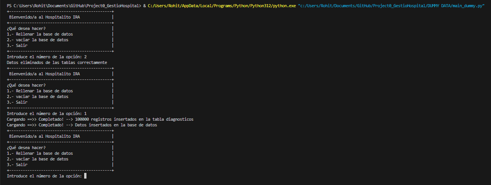
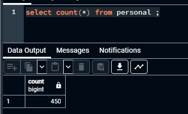
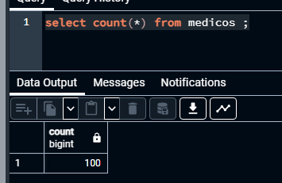
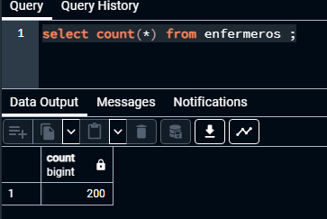
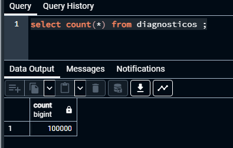
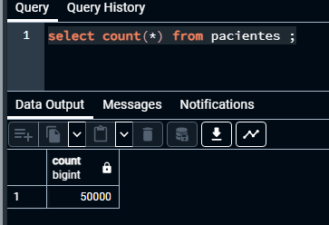

# DUMMY DATA

## Llibreries utilitzades

- Python Faker (Per crear dades fake REALISTES en mode NO cirílic)
- Random (per crear dades aleatories entre lletres i numeros)
- psycopg2 (per connectar-nos o atacar la base de dades MESTRA i fer consultes i insercions)
- string && time (per fer joins entre temps real i timestamp en les taules pacients i/o visites)

## Estructura

Per a cada acció a les taules, o sigui insercions hem creat una funció amb un paràmetre que en aquest cas és la quantitat de registres que voldrem incrustar

```
def enfermeros(qty):
    try:
        conn = psycopg2.connect(database="hospital",user="postgres", password=pswd,host=host_conn,port="5432")
        conn.autocommit = True
        cur = conn.cursor()
        count = 0
        for i in range(qty):
            count += 1
            p_id = i + 101
            cur.execute(f"INSERT INTO enfermeros(p_id,experiencia) VALUES ({p_id},'{faker.job()}')")
        print("\033[F\033[K", end="")  # Clear the previous line
        print(f"Cargando ==>> Completado! --> {count} registros insertados en la tabla enfermeros")
        cur.close()
        conn.close()
    except psycopg2.Error as e:
        print(f"Error inserting enfermeros data: {e}")
```
Totes les funcions estan creades [aqui](manipulacion_dummy.py)

Per administrar totes aquestes funcions tenim un menú creat per a l'usuari final [aqui](main_dummy.py)

# Wiki

[Errors de psql](https://www.psycopg.org/docs/errors.html)

[Joins](https://www.w3schools.com/python/ref_string_join.asp)

[Ascii Loading](https://www.ibm.com/docs/en/sdse/6.4.0?topic=configuration-ascii-characters-from-33-126)


# Exemple



# Comprovacions










