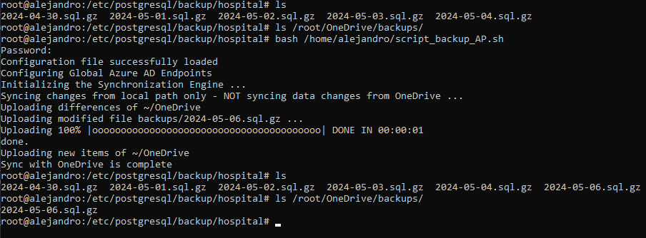
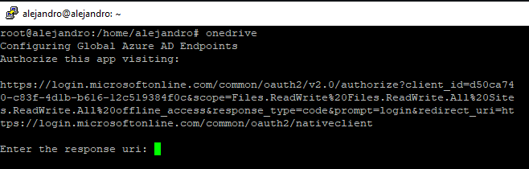
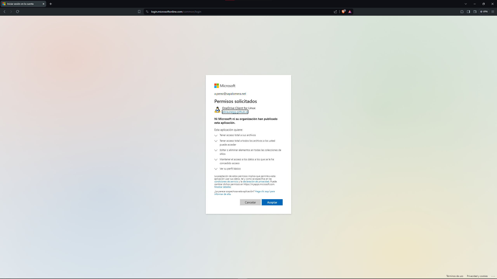
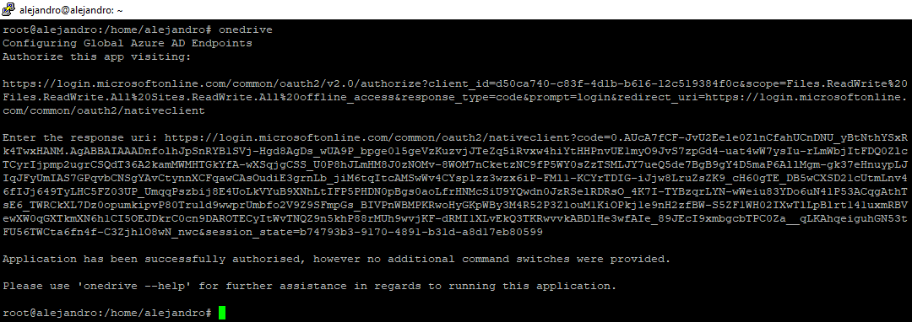
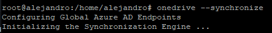
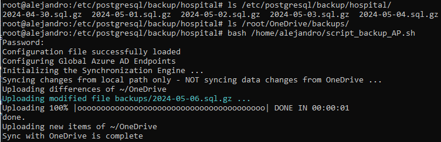

# CREACIÓ I RESTAURACIÓ DE CÒPIES DE SEGURETAT

# Com fer còpies de seguretat?
Per fer els backups a la nostra base de dades haurem de fer un codi al sistema que ens permeti fer les còpies de seguretat juntament amb la seva automatització.
El script que s'haurá de crear dins de la nostra màquina será en el nostre cas, un script que ens permeti fer una còpia de seguretat a nivell lògic, com el següent:

```
#!/bin/bash
# Dades d'accés a POSTGRESQL server
user="postgres"
export pgpassword="P@ssw0rd"
server="192.168.56.104"
database="hospital
"
# Ruta on volem guardar els arxius de backup
BACKUP_PATH="/etc/postgresql/backups/hospital"
# Variable amb la data actual per identificar les diferents còpies de seguretat
current_date=$(date +"%Y-%m-%d")

# Fem la còpia de totes les bases de dades que hi ha a PostgreSQL server
pg_dump -h $server -U $user $database > $BACKUP_PATH/$current_date.sql;

# Comprimim l'arxiu de backup
gzip $BACKUP_PATH/$current_date.sql

# Eliminem els arxius de backup creats fa més de 5 dies
DAYS=5
find $BACKUP_PATH/* -mtime +$DAYS -exec rm {} \;


```


# Per què hem decidit fer còpies de seguretat a nivell lògic?
Aquest tipus de backup exporta l' estructura de les taules i les dades sense copiar els arxius de dades reals de la base de dades. Per exemple, la comanda pg_dump realitza un backup lògic, perquè exporta les taules i les dades mitjançant les sentències SQL CREATE TABLE i INSERT.

Ens hem decidit per aquest tipus de backup degut que ofereix més flexibilitat que el backup físic ja que podem editar les taules i les dades abans de restaurar la còpia de seguretat, però té l'inconvenient que pot necessitar més temps que el backup físic a l'hora de restaurar la còpia.

# Com automatizar les còpies de seguretat?
També ens haurem d'assegurar que el nostre codi ens permeti automatizar aquest script mitjançant crontab, si per exemple, volem realitzar una còpia de seguretat de la base de dades cada dia a les 0:00, hauriem de
afegir la següent línia al crontab:
Els primers dos dígits corresponen als minuts i l'hora respectivament.
Seguidament tenim el dia del mes, el mes, y el dia de la setmana.
En aquest cas s'executará cada dia a les 0:00.
```
0 0 * * * sh /home/hospital/script_backup.sh
```


# Com restaurar una còpia de seguretat?
Per restaurar una còpia de seguretat, haurem de crear un script que ens permeti identificar la còpia de seguretat més recent, descomprimir-la i seguidament restaurar-la.

```
#!/bin/bash

# Busquem la còpia de seguretat més recent i la desem a una variable
archivo_mas_reciente=$(find /etc/postgresql/backup/hospital -type f -mtime -5 | sort -n | tail -n 1)

# Descomprimim la còpia de seguretat més recent
sudo gzip -d "$archivo_mas_reciente"

# Actualitzem la variable del arxiu més recent perquè agafi el .sql
archivo_mas_reciente=$(find /etc/postgresql/backup/hospital -type f -mtime -5 | sort -n | tail -n 1)

# Restaurem la còpia de seguretat més recent
psql -d hospital -f "$archivo_mas_reciente"
```
# Com pujar les còpies de seguretat al núvol?
Per fer les còpies de seguretat farem servir OneDrive, primer l'haurem d'instal·lar. Per fer-ho, començarem executant el següent script que ens assegurarà que el nostre sistema està al dia.
```
#!/bin/bash
rm -rf /var/lib/dpkg/lock-frontend
rm -rf /var/lib/dpkg/lock
apt-get update
apt-get upgrade -y
apt-get dist-upgrade -y
apt-get autoremove -y
apt-get autoclean -y
```

Seguidament executarem les següents comandes
```
wget -qO - https://download.opensuse.org/repositories/home:/npreining:/debian-ubuntu-onedrive/Debian_12/Release.key | gpg --dearmor | sudo tee /usr/share/keyrings/obs-onedrive.gpg > /dev/null

echo "deb [arch=$(dpkg --print-architecture) signed-by=/usr/share/keyrings/obs-onedrive.gpg] https://download.opensuse.org/repositories/home:/npreining:/debian-ubuntu-onedrive/Debian_12/ ./" | sudo tee /etc/apt/sources.list.d/onedrive.list 

sudo apt-get update

sudo apt install --no-install-recommends --no-install-suggests onedrive
```

Finalment executarem la comanda onedrive, ens donarà una adreça on haurem de loguejar amb el nostre compta



Una vegada introduida la compta, ens retornarà un link que haurem de posar a la terminal.

Una vegada fet, sincronitzem onedrive amb la nostra màquina amb la comanda onedrive --synchronize


Una vegada hem fet la sincronització, tindrem creada una carpeta OneDrive en el següent directori `/root/OneDrive/` aqui crearem una carpeta anomenada backups. A continuació, modificarem el script per fer afegir les còpies al núvol, afegirem les següents línies al nostre codi:
```
# Guardem una còpia al onedrive
cp "$BACKUP_PATH/$current_date.sql.gz" "/root/OneDrive/backups/$current_date.sql.gz"

# Sincronitzem amb el núvol per desar els canvis
onedrive --synchronize --upload-only
```
Una vegada executat el script podrem comprovar com es puja la còpia de seguretat al núvol


