# Webgrafia

https://www.servermania.com/kb/articles/setup-postgresql-cluster

# REPLICACIO ENTRE MASTER I SLAVE

MASTER

Configurem els següents paràmetres de configuració al postgres.conf

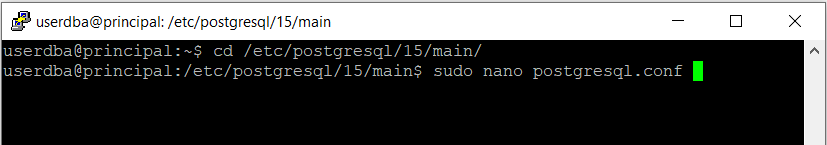

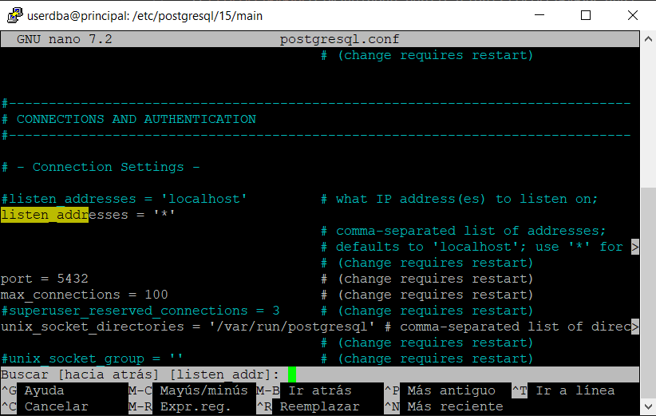

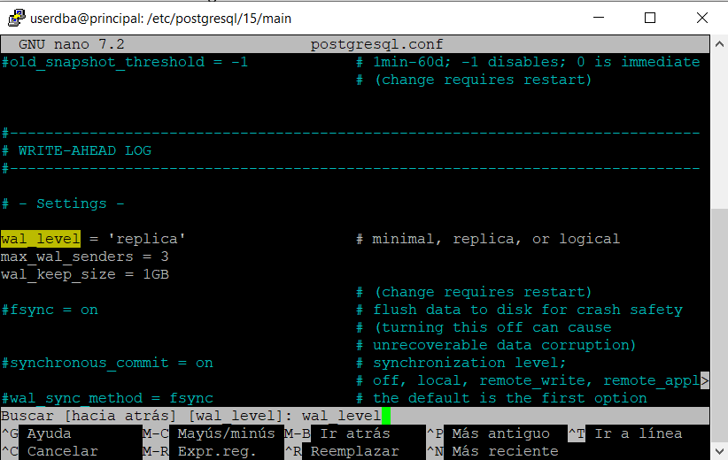

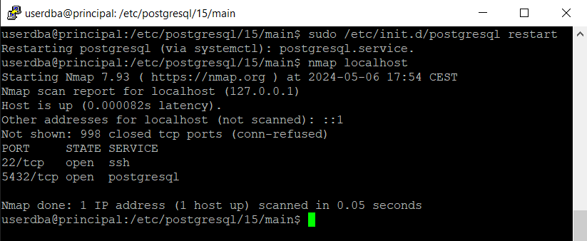

SLAVE

Configurem els següents paràmetres de configuració al postgres.conf

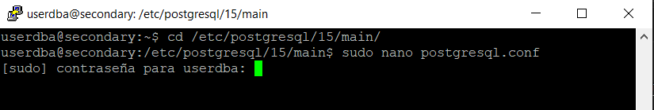

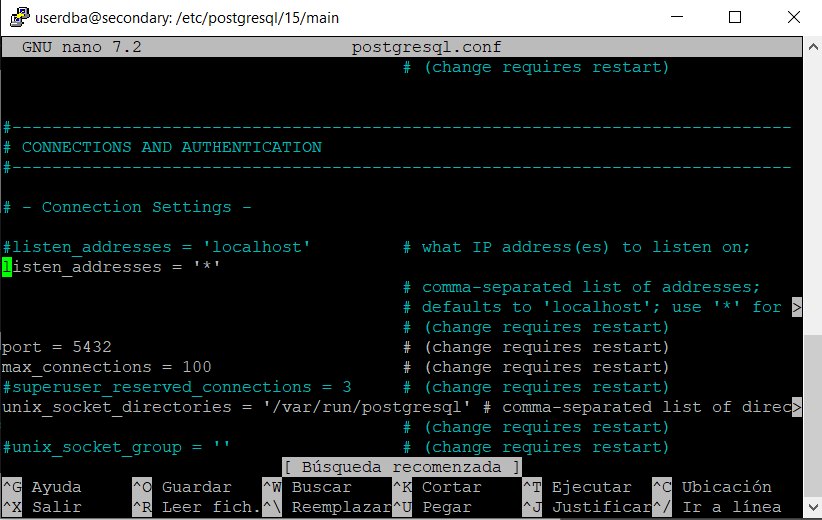

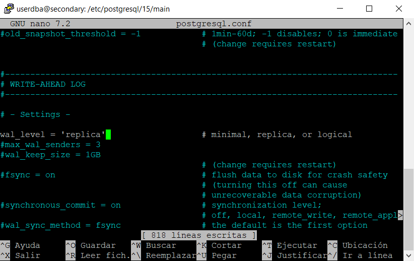

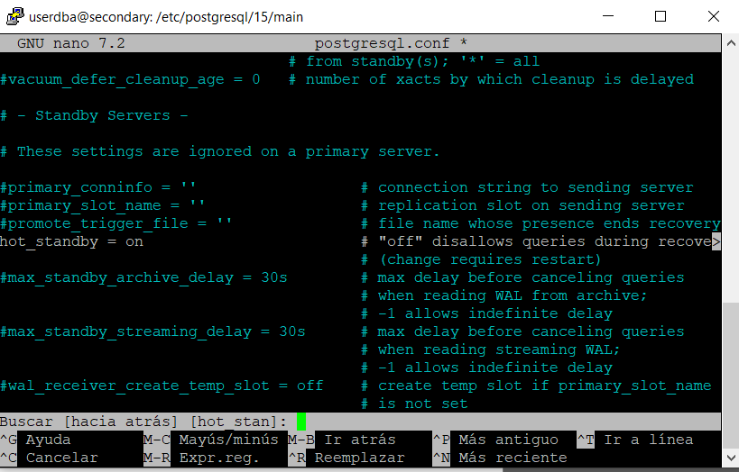

MASTER

creem un rol per a fer les repliques
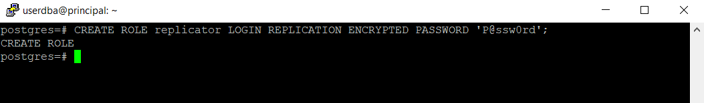

Creació d'un slot per a replicacions

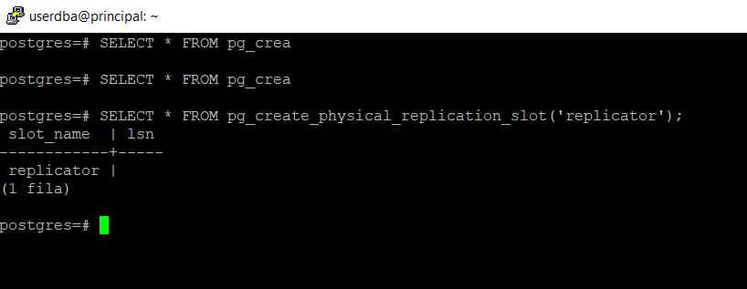

Ara configurem la autentificacio

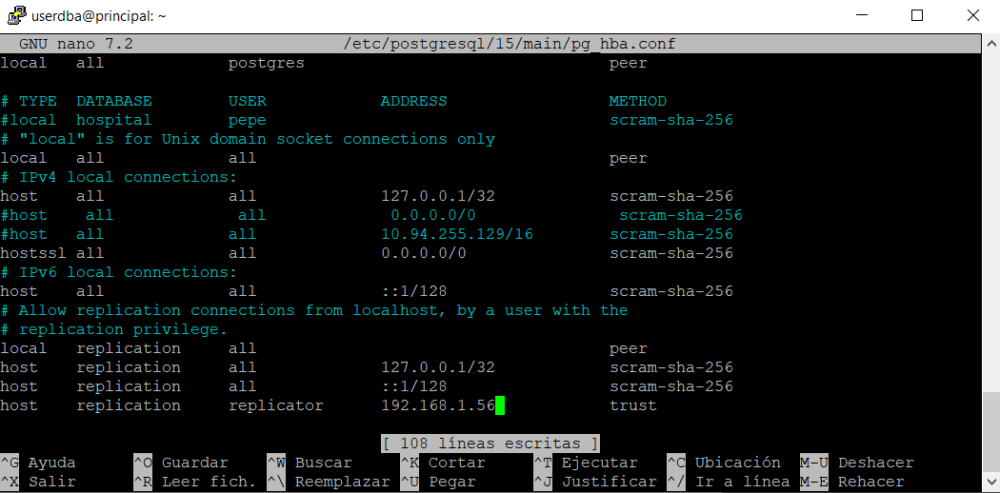

Finalment reiniciem el servei postgres ambdós servidors:

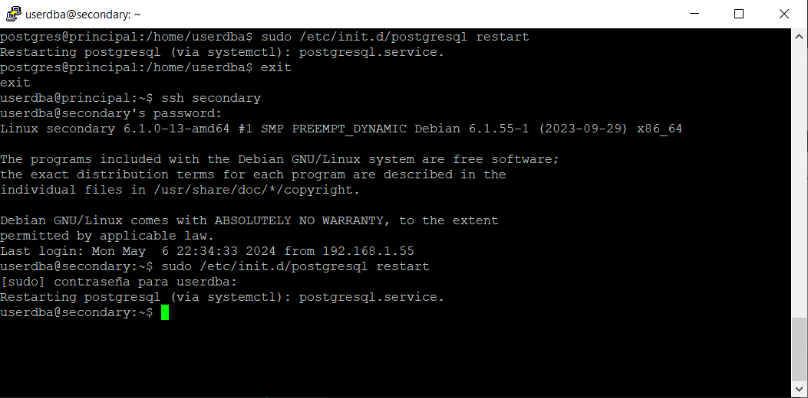

Ara iniciarem la replicacio

Netejem les dades per replicar en el slave:

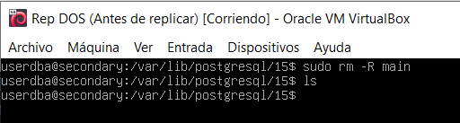

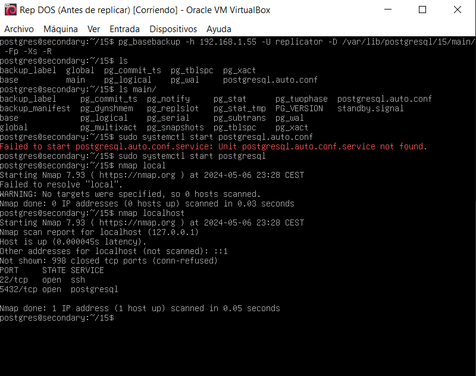

MASTER

select * from pg_stat_replication

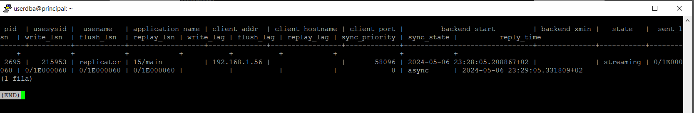

SLAVE

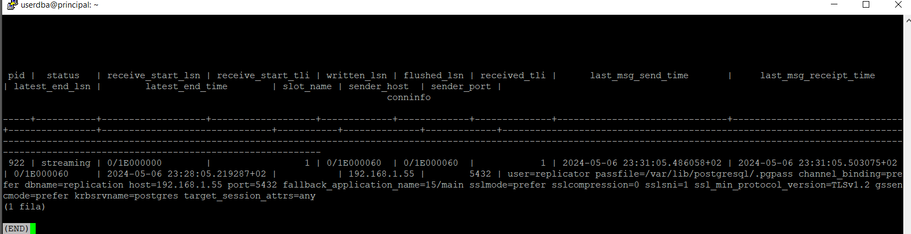

#Prova

Creació de base de dades exemple:

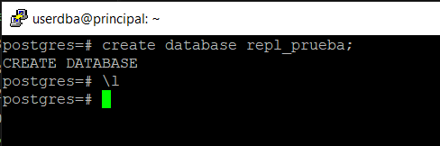

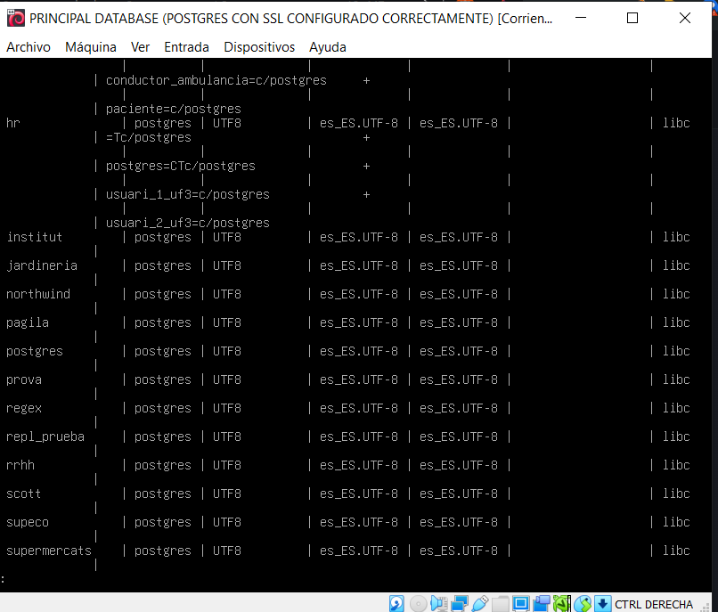

# BALANCEIJ

Utlitzarem uan clusterització, i sigui crearem una IP Mestra per a que la aplicació ataqui a un sol servidor, o ben dit servei i ja el servei s'encarrega de dir el servidor que ataca i si un peta, la aplicació seguira sent utilitzada.

Instal·lació:

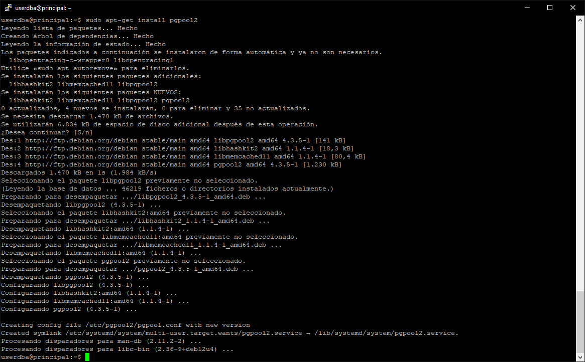
