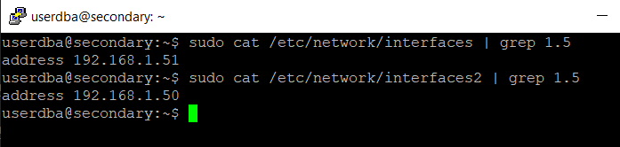
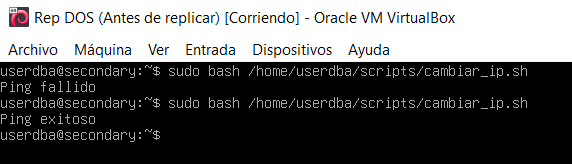

# Webgrafia

https://www.servermania.com/kb/articles/setup-postgresql-cluster

# REPLICACIO ENTRE MASTER I SLAVE

MASTER

Configurem els següents paràmetres de configuració al postgres.conf


SLAVE

Configurem els següents paràmetres de configuració al postgres.conf


MASTER

creem un rol per a fer les repliques


Creació d'un slot per a replicacions


Ara configurem la autentificacio


Finalment reiniciem el servei postgres ambdós servidors:


Ara iniciarem la replicacio

Netejem les dades per replicar en el slave:


MASTER

select * from pg_stat_replication


SLAVE


#Prova

Creació de base de dades exemple:


# BALANCEIJ D'APLICACIO

Utilitzarem un script per ablacejar el servidor i que continui funcionant la aplicació des d'on va deixa de funcionar.


```
if ping -c 1 192.168.1.50 &>/dev/null; then
    echo "Ping exitoso"
else
    echo "Ping fallido"
    # Ejecutar el comando para redirigir el contenido
    sudo cat /etc/network/interfaces2 > /etc/network/interfaces
fi
```
Els fitxers, a dins tenen la ip canvaida, i el script , si no va el ping, sobrescriu i reinicia el adaptador de xarxa:



Quan el servidor principal no esta actiu, executaem el script per simular:



La següent vegada si que funciona ja que pot fer ping a si mateix.