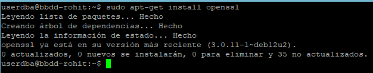
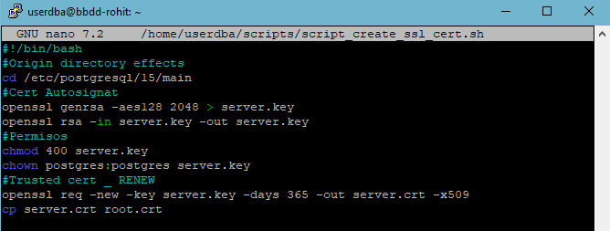
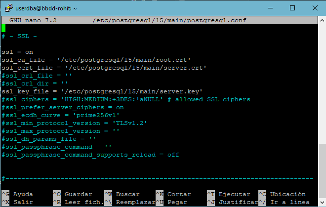
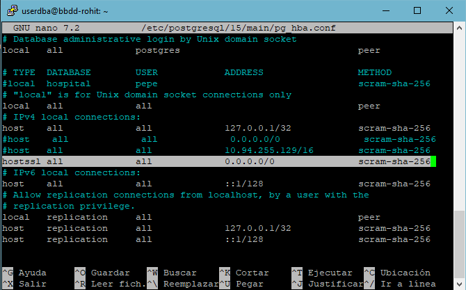
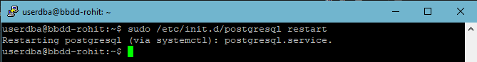
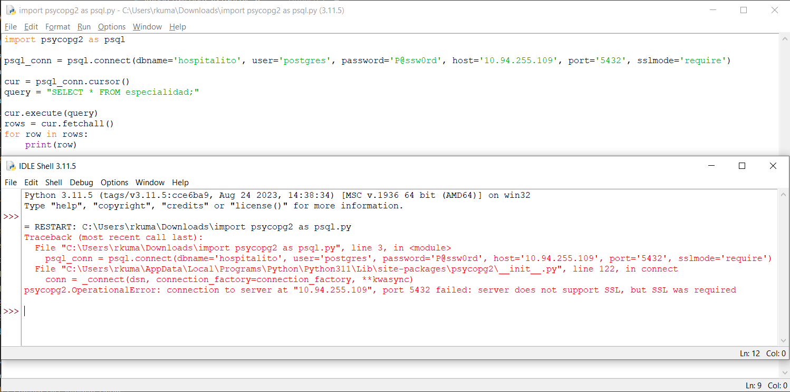
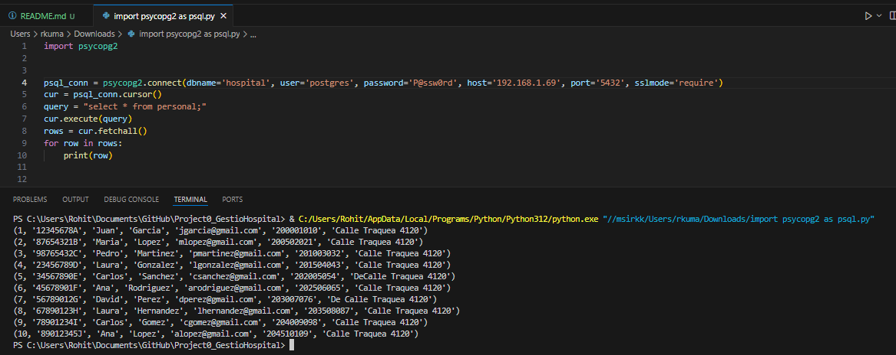
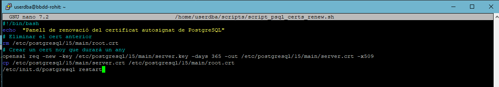
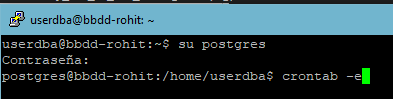
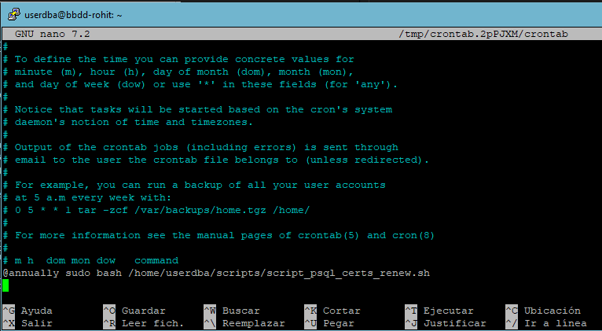

# Configuració de SSL

## Introducció

El SSL (Secure Sockets Layer) en PostgreSQL és un protocol de seguretat que permet establir connexions segures i encriptades entre un client i un servidor de base de dades. En habilitar el SSL, s'utilitza un certificat digital per a autenticar i protegir la comunicació contra escoltes i manipulacions no autoritzades. Això s'especialment important quan es manegen dades sensibles. Per a habilitar el SSL, s'han de generar i configurar els certificats adequats en el servidor i en el client. Existeixen diversos tipus de certificats i alguns d'ells o la gran mayoria somni de pagament pel fet que s'usa per a protejer el sistema i que ningú més pugui accedir a ells o sigui des d'un sniffer o un altre atac.

# Instal·lació

Per instal·lar o configurar SSL s'han de crear una arxius que permeten xifrar les dades, s'anomenen certificats, en aquest cas farem un certificat `autosignat`.

1. Instal·lació de openssl (`sudo apt-get isntall openssl`)



2. Creació d'un script per crear certificats i clau privada. (Ho faré de cop amb un script pero també el pot fer de comanda a comanda executant en consola):

```
    #Origin directory effects
cd /etc/postgresql/15/main
    #Cert Autosignat
openssl genrsa -aes128 2048 > server.key
openssl rsa -in server.key -out server.key
    #Permisos
chmod 400 server.key
chown postgres:postgres server.key
    #Trusted cert _ RENEW
openssl req -new -key server.key -days 365 -out server.crt -x509
cp server.crt root.crt
```


3. Ara apliquem el cert a la configuració de ssl amb `sudo nano /etc/postgresql/15/main/postgresql.conf`. I també hem de permetre connexions ssl amb `sudo nano /etc/postgresql/15/main/pg_hba.conf`





4. Finalment reiniciem el servei Postgresql




## Comprovacions

- Abans de configurar SSL



- Després de configurar SSL



## Renovació

1. Per renovar el cert he fet un script que s'executará cadacert temps i estarà automatitzat

```
# Eliminar el cert anterior
rm /etc/postgresql/15/main/root.crt
# Crear un cert noy que durará un any
openssl req -new -key /etc/postgresql/15/main/server.key -days 365 -out /etc/postgresql/15/main/server.crt -x509
cp /etc/postgresql/15/main/server.crt /etc/postgresql/15/main/root.crt
sudo /etc/init.d/postgresql restart

```

2. Automatitzarem aquest script per a que es renovi cada any i com el el fitxer estarà  





## Webgarfia 
- [Link](https://demirhuseyinn-94.medium.com/postgresql-ssl-configuration-to-connect-database-114f867d96e0)

