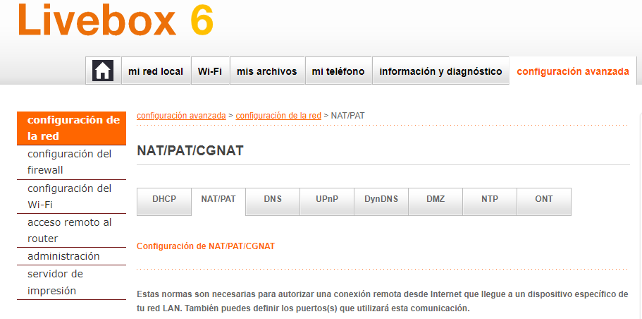
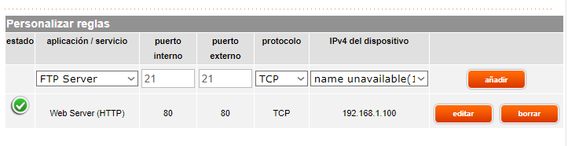
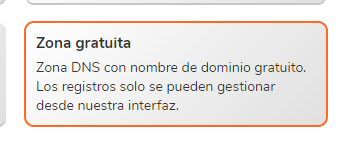
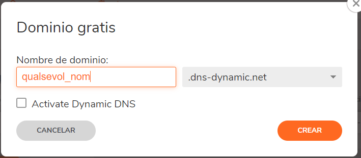
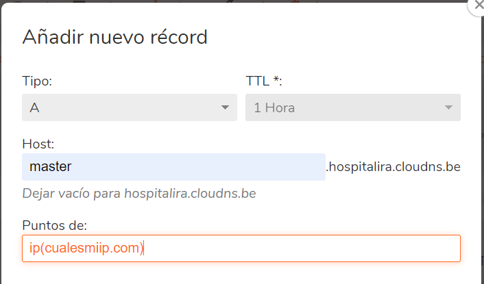
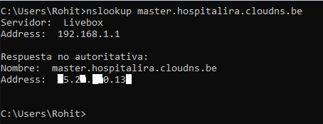
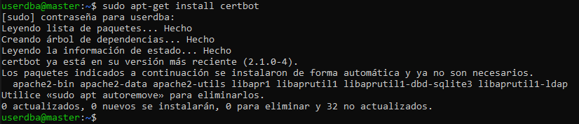
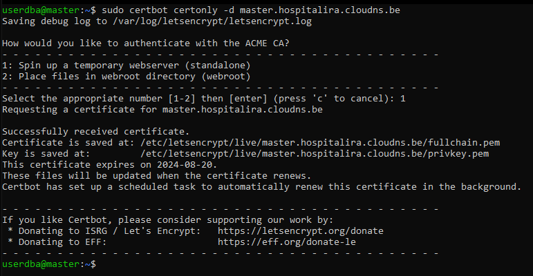
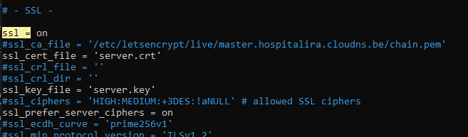
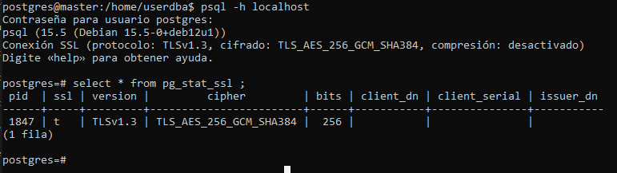

# Configuració de SSL

## Introducció

El SSL (Secure Sockets Layer) en PostgreSQL és un protocol de seguretat que permet establir connexions segures i encriptades entre un client i un servidor de base de dades. En habilitar el SSL, s'utilitza un certificat digital per a autenticar i protegir la comunicació contra escoltes i manipulacions no autoritzades. Això s'especialment important quan es manegen dades sensibles. Per a habilitar el SSL, s'han de generar i configurar els certificats adequats en el servidor i en el client. Existeixen diversos tipus de certificats i alguns d'ells o la gran mayoria somni de pagament pel fet que s'usa per a protejer el sistema i que ningú més pugui accedir a ells o sigui des d'un sniffer o un altre atac.

# Configuracions Prèvies

Publicar el meu servidor via http en NAT des del meu router:

1. Entrar a la configuració del Router i entrar a NAT:

2. Llavors crear una regla per fer redicció del port de http del VM MASTER a la ip publica del router:

3. Saber la IP Pública del router de casa amb [cualesmiip.com](https://cualesmiip.com)

La Ip ha de ser de 4 octets(La imatge es un exempe i està editat per la privacitat.)

4. Crear un Allotjament DNS Públic Gratuït , Cloudns t'ofereix un de gratuït

Iniciem sessió o Ens registrem:

Creem nove zona:

Creem nou registre A que será la IP del nostre servidor MESTRE:

5. Una vegada fet tot això, fem nslookup per a vertificar que funciona:

# Instal·lació Certificats

instal·lem Certbot al servidor MESTRE

Fem la petició per els certificats SSL des del domini master amb certbot

# Configuració Postgresql

Ara hem de configurar aquests certificats al postgres

Obrim /etc/postgresql/15/main/postgresql.conf

Per a que les rutes llargues siguien més afcils he fet aquets script:

 #!/bin/bash
 umask 0177
 DOMAIN=master.domini.be
 DATA_DIR=/var/lib/postgresql/12/main
 cp /etc/letsencrypt/live/$DOMAIN/fullchain.pem $DATA_DIR/server.crt
 cp /etc/letsencrypt/live/$DOMAIN/privkey.pem $DATA_DIR/server.key
 chown postgres:postgres $DATA_DIR/server.crt $DATA_DIR/server.key

finalment he fet sudo /etc/init.d/postgresql restart

# Comprovacions

