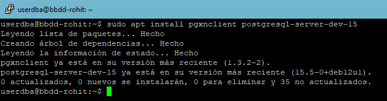
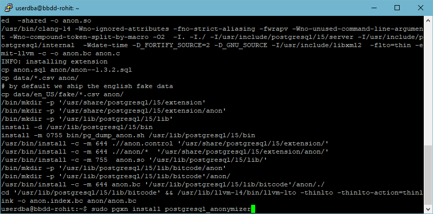
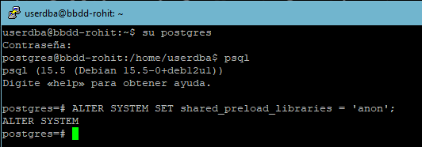
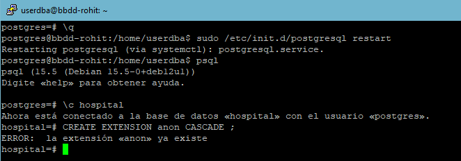
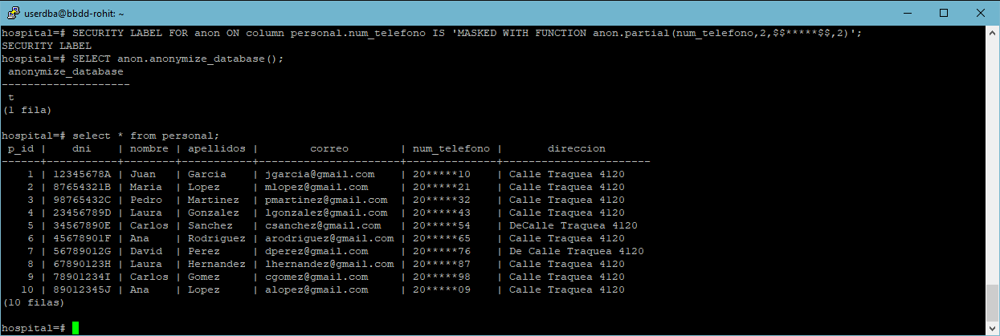

# Data Masking

## Introducció
L'emmascarament de dades és una tècnica utilitzada per a protegir la informació sensible en reemplaçar-la amb dades fictícies o alterades. En el codi que vas proporcionar, es mostra un exemple de com emmascarar el camp de correu electrònic en una consulta SQL.

## Instal·lació
En aquesta part procedirem instal·lar `anon` a la nostra base de dades PSQL.

1. Instal·lem pgxn amb `sudo apt install pgxnclient postgresql-server-dev-15`

2. Instal·lem anon amb `sudo pgxn install postgresql_anonymizer`

## Carregar anon a psql

1. Carreguem anon al sistema de base de dades:

2. Creació de la extensió

## Dynamic Masking

1. Inicialitzem anon, apliquem un security label i apliquem les regles d'aquestes maneres

# Webgrafia

[Link](https://www.youtube.com/watch?v=niIIFL4s-L8&t=45s)